# 🎙️ Deepfake Voice Authenticator

> An AI-powered web application for detecting whether an uploaded voice recording is **Real** or **AI-Generated (Deepfake)** using a dedicated Machine Learning inference service.


---

# 📌 Overview

Deepfake Voice Authenticator is a secure AI-powered web application that detects AI-generated voice recordings. The system combines a React frontend, a FastAPI authentication backend, and a dedicated Machine Learning inference service.

Users can securely register, log in, upload audio recordings, and receive predictions indicating whether the voice is **REAL** or **FAKE**. Every prediction is stored in PostgreSQL and is accessible through the user's history dashboard.

The Machine Learning model is isolated into its own inference service, making the application scalable, modular, and production-ready.


# 🎤 Deepfake Voice Authenticator

<p align="center">
  
</p>
---

# ✨ Features

### 🔐 Authentication

- User Registration
- Secure Login
- JWT Authentication
- Password Hashing
- Protected Routes

### 🎤 Audio Authentication

- Upload Audio Files
- Deepfake Voice Detection
- Confidence Score
- Probability Score
- Processing Time
- Model Information

### 📊 History

- Prediction History
- View Previous Analyses
- Stored in PostgreSQL

### ⚙️ Backend

- FastAPI REST API
- SQLAlchemy ORM
- Pydantic Validation
- Professional Logging
- Docker PostgreSQL Support

### 🤖 AI Inference

- Dedicated ML Microservice
- Wav2Vec2 Feature Extraction
- Support Vector Machine (SVM) Classification

---

# 🏗 System Architecture

```text
                    React Frontend
                          │
                          ▼
                FastAPI Authentication API
                          │
                          ▼
            Deepfake Voice Inference API
          (Wav2Vec2 + SVM Classification)
                          │
                          ▼
                  PostgreSQL Database
```

---

# 🔄 Workflow

1. User registers and logs in.
2. JWT token is generated.
3. User uploads an audio recording.
4. Backend validates the request.
5. Audio is sent to the Inference API.
6. The ML model extracts Wav2Vec2 embeddings.
7. The SVM classifier predicts whether the voice is REAL or FAKE.
8. Results are returned to the backend.
9. Prediction details are stored in PostgreSQL.
10. User can view the prediction in the History page.

---

# 🧠 Machine Learning Pipeline

### Feature Extraction

- Facebook Wav2Vec2
- Embedding Size: **768**

### Classifier

- Support Vector Machine (SVM)

### Prediction Output

- REAL
- FAKE

### Returned Information

- Prediction
- Probability
- Confidence
- Processing Time
- Model Version
- Audio Statistics

---

# 🛠 Tech Stack

## Frontend

- React
- Axios
- React Router
- CSS

## Backend

- FastAPI
- SQLAlchemy
- Pydantic
- JWT Authentication
- Passlib
- Requests

## Machine Learning

- Transformers
- Wav2Vec2
- Scikit-learn
- NumPy
- Librosa
- Joblib

## Database

- PostgreSQL

## DevOps

- Docker
- Git
- GitHub

---

# 📂 Project Structure

```text
deepfake-voice-authenticator/
│
├── backend/
│   ├── app/
│   │   ├── api/
│   │   ├── core/
│   │   ├── models/
│   │   ├── services/
│   │   ├── utils/
│   │   ├── config.py
│   │   ├── logger.py
│   │   └── main.py
│   │
│   ├── uploads/
│   ├── requirements.txt
│   ├── Dockerfile
│   └── .env.example
│
├── frontend/
│
└── README.md
```


---
### Demo 


## YouTube : https://youtu.be/JozBmlopJaQ?si=VJUMbj4WA4-cS9fi


## Frontend : https://deepfake-voice-authenticator-five.vercel.app


## Backend : https://deepfake-voice-authenticator-l9qa.onrender.com/docs


## Google Colab : https://colab.research.google.com/drive/1WM0-_io58R-2IbJej2PHLyHVhzH_OuCC?usp=sharing


# Note: First run the google colab then the backend and frontend.


---

<h2 align="center">📸 Application Screenshots</h2>

<p align="center">
  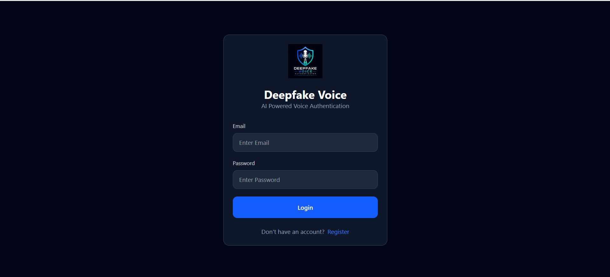
  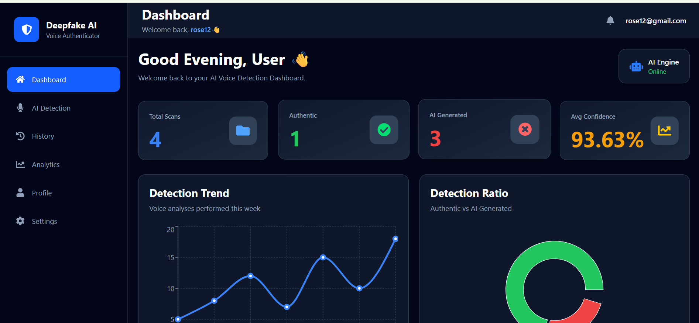
  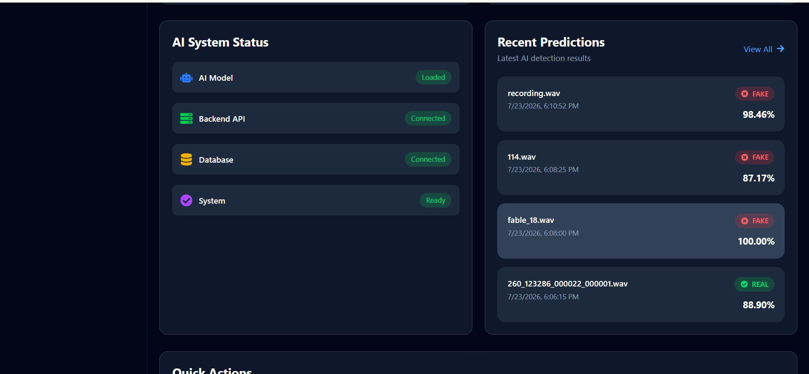
  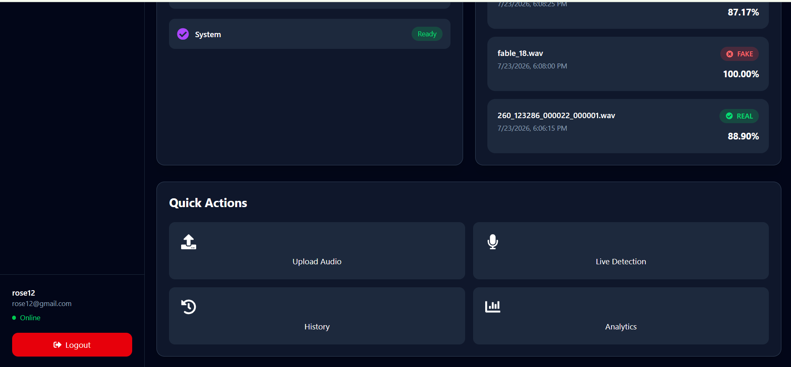
</p>

<p align="center">
  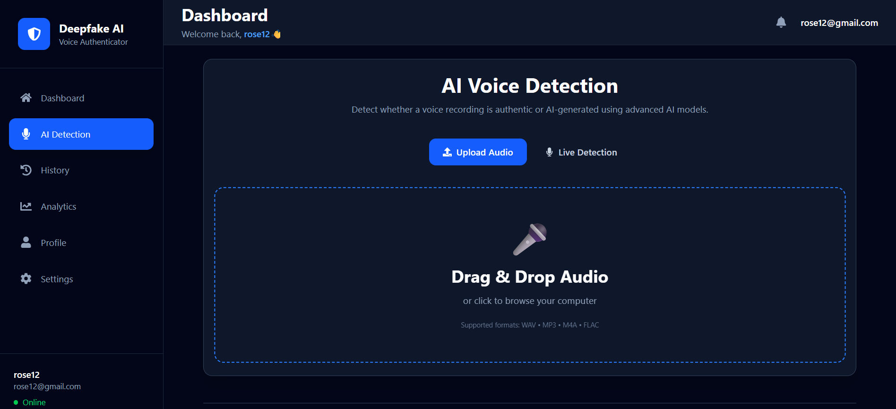
  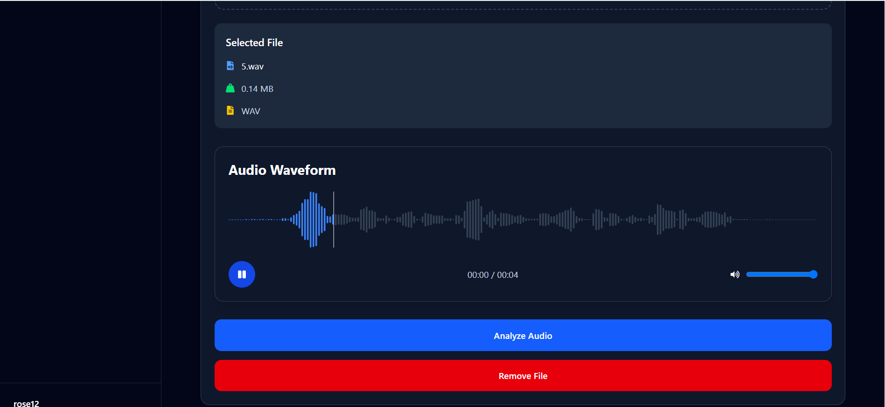
  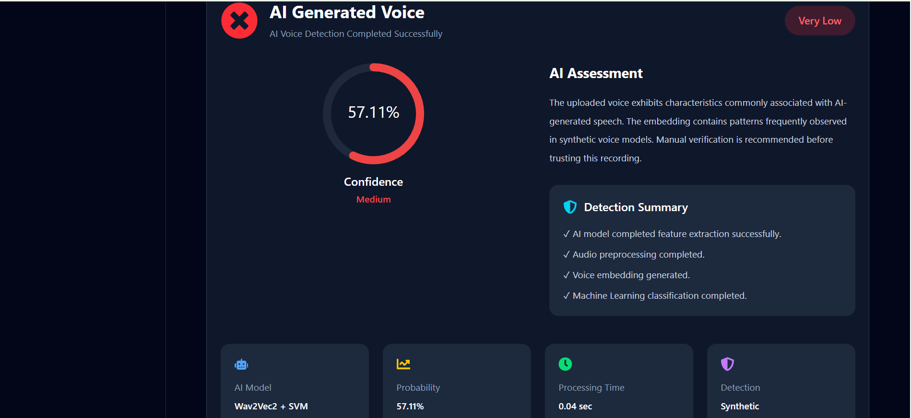
  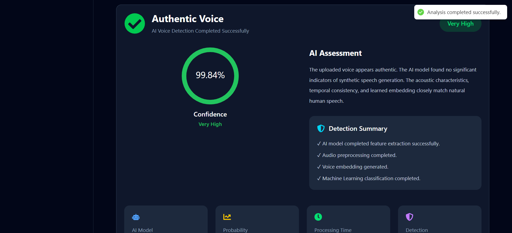
  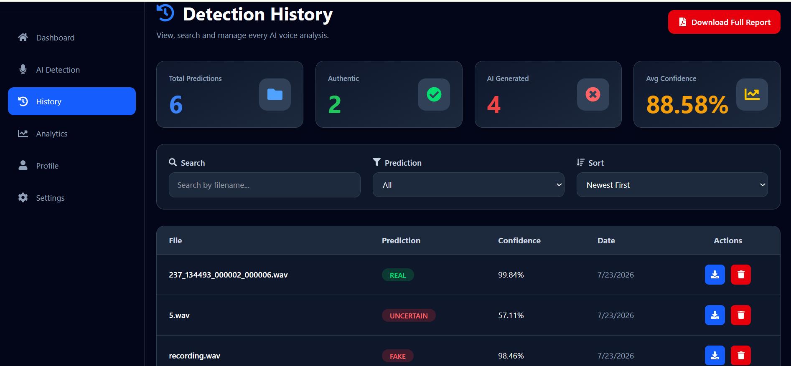
</p>

<p align="center">
  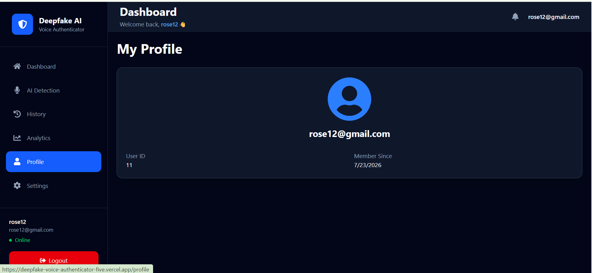
  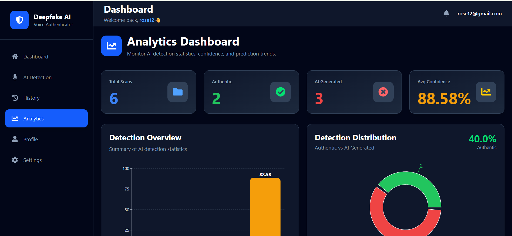
  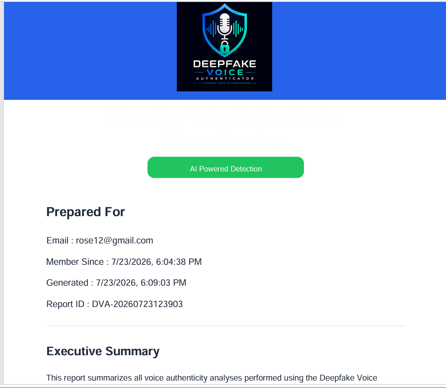
  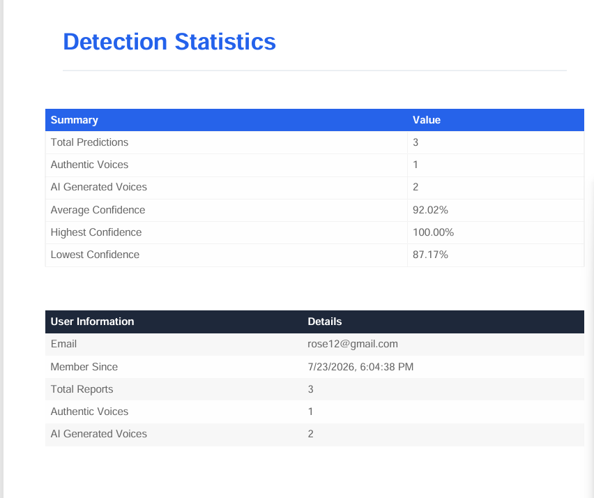
  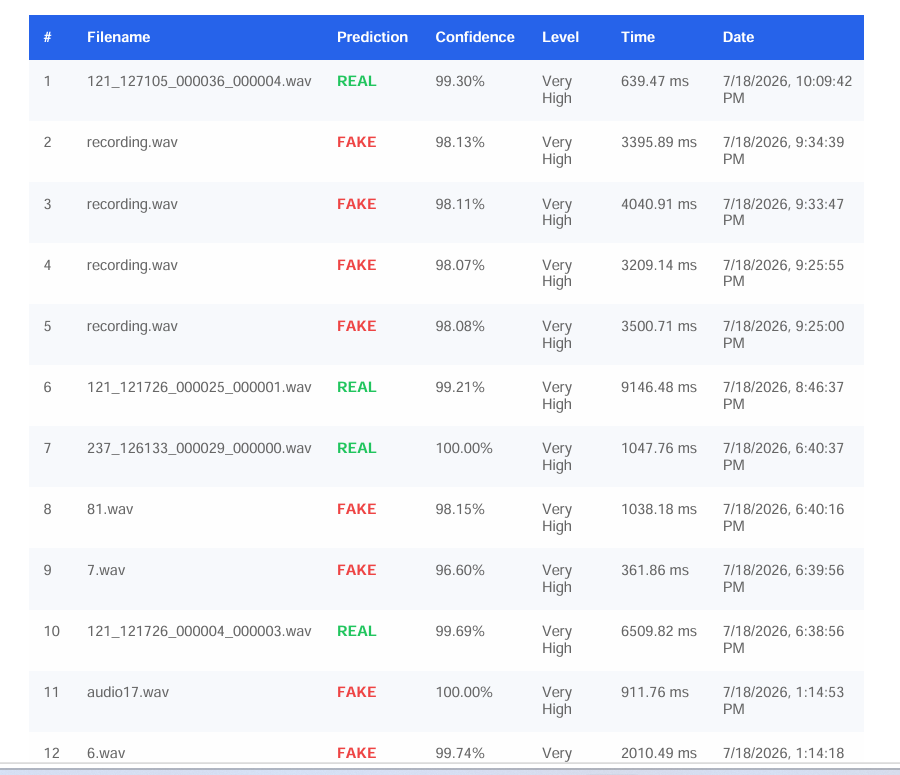
  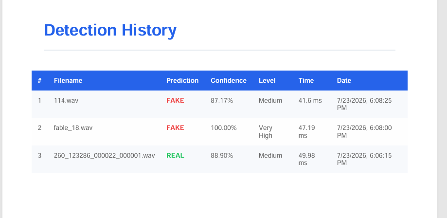
  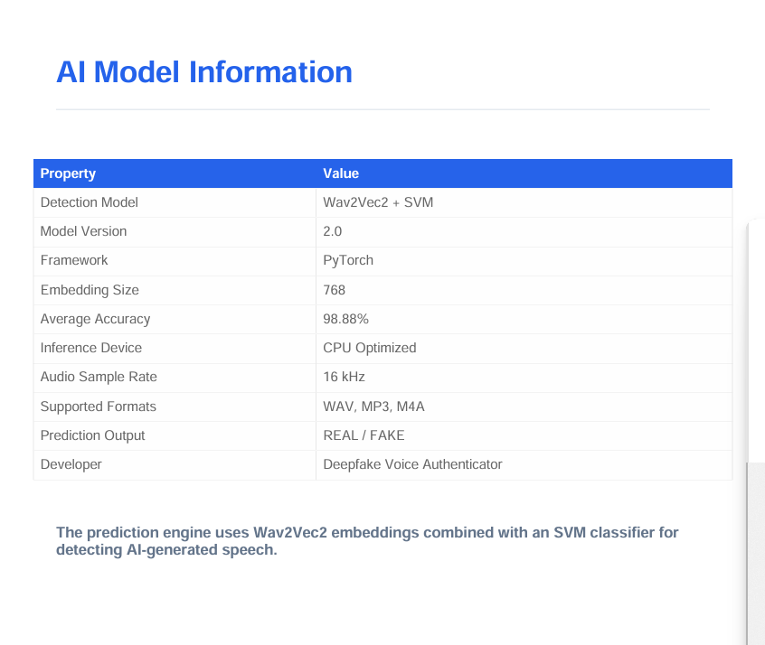
</p>

<p align="center">
  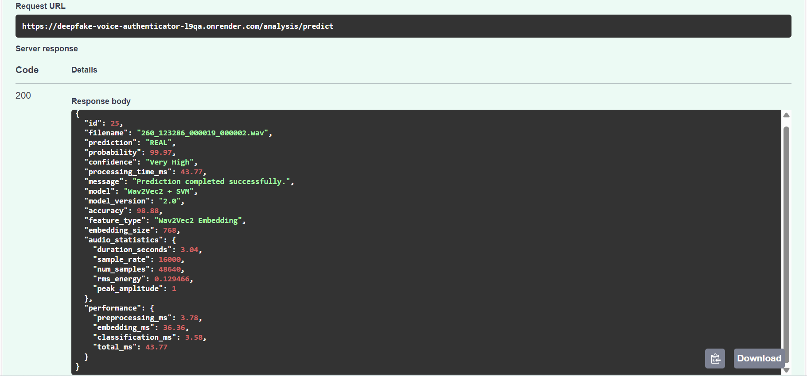
  
</p>

<p align="center">
  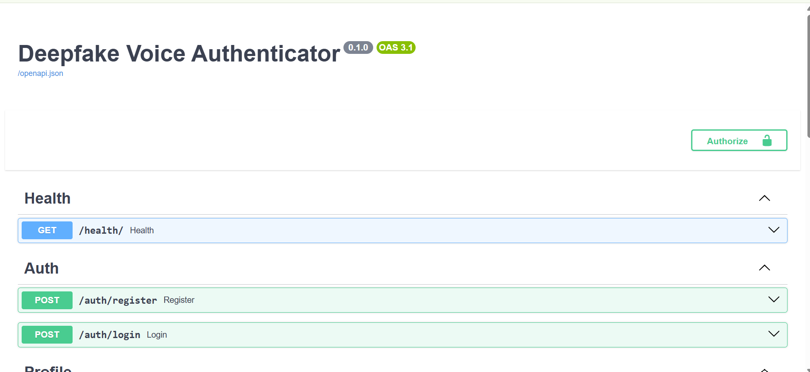
  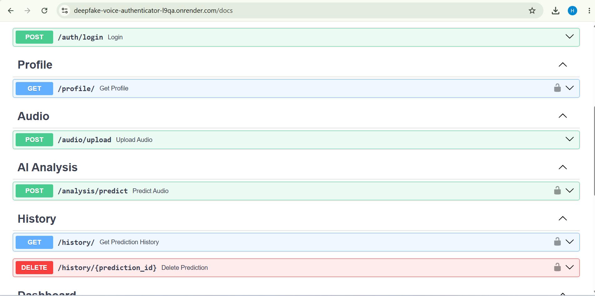
  
  
  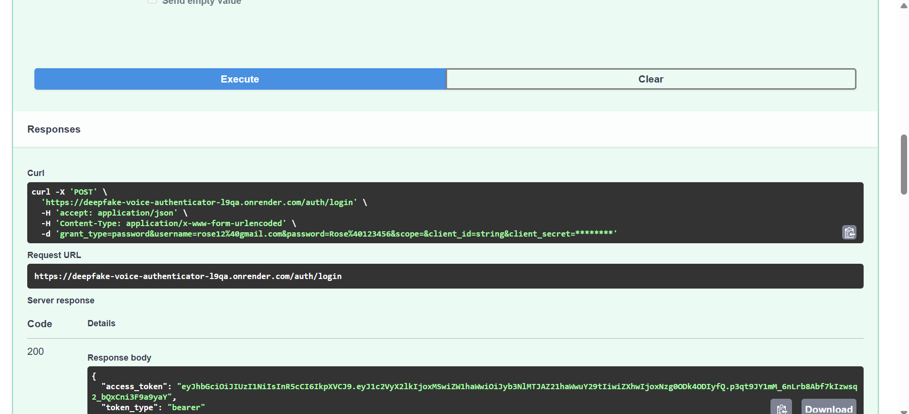
  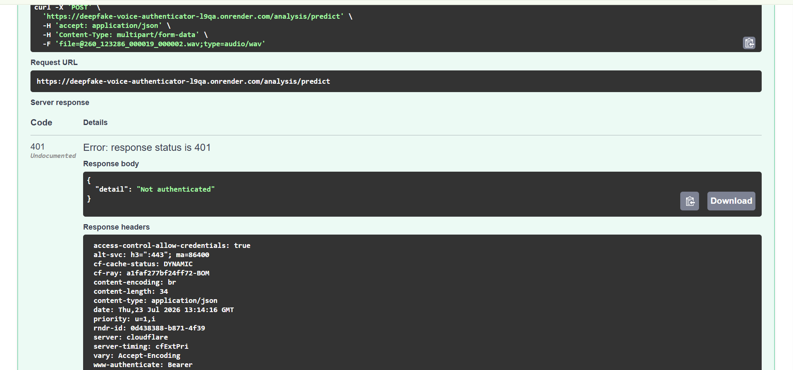
</p>


# 🌐 API Endpoints

## Authentication

| Method | Endpoint | Description |
|----------|-----------|-------------|
| POST | `/auth/register` | Register a new user |
| POST | `/auth/login` | Login user |

---

## Audio

| Method | Endpoint | Description |
|----------|-----------|-------------|
| POST | `/audio/upload` | Upload audio for prediction |
| GET | `/audio/history` | View prediction history |
| GET | `/audio/{id}` | Get prediction details |
| DELETE | `/audio/{id}` | Delete prediction record |

---

# 🔒 Security

- JWT Authentication
- Password Hashing
- Protected Endpoints
- Environment Variables
- Input Validation
- File Validation
- Secure Database Storage

---

# 🚀 Installation

## Clone Repository

```bash
git clone https://github.com/Hema-5187/deepfake-voice-authenticator.git


For ML Inference clone this repository in another folder
git clone https://github.com/Hema-5187/deepfake-voice-inference.git
```

---

## Backend

```bash
cd backend

python -m venv venv

# Windows
venv\Scripts\activate

pip install -r requirements.txt

uvicorn app.main:app --reload
```

---

## Frontend

```bash
cd frontend

npm install

npm run dev
```

---

# ⚙️ Environment Variables

Create a `.env` file.

```env
DATABASE_URL=your_database_url

SECRET_KEY=your_secret_key

ALGORITHM=HS256

ACCESS_TOKEN_EXPIRE_MINUTES=30

INFERENCE_API_URL= https://your-inference-service-url/predict

INFERENCE_TIMEOUT=60
```

---

# 🚀 Deployment

| Component | Platform |
|------------|----------|
| Frontend | Vercel |
| Backend | Render |
| Inference API | Render |
| Database | Neon PostgreSQL |

---

# 🔮 Future Improvements

- Real-time Voice Authentication during phone calls and develop mobile application for Android and iOS
- Batch Audio Analysis
- Email Verification
- Password Reset
- CI/CD Pipeline
- Multi-language Support
- Deploying the ML model permanently on GPU Cloud Infrastructure

---

# 📄 License

This project is licensed under the **MIT License**.

---

# 👩‍💻 Author

**Hema Maurya**

B.E. Computer Science & Engineering (AI & ML)

Viva Institute of Technology

---

⭐ If you found this project useful, consider giving it a star on GitHub!